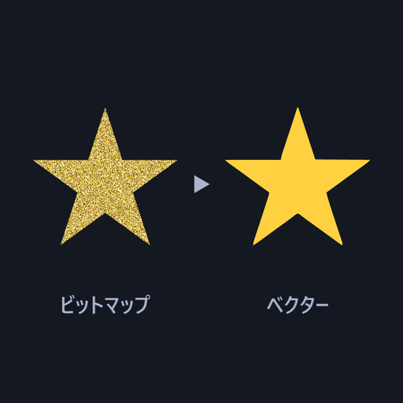

# SVG_TRACE



画像ファイルや別レイヤーの絵をトレースしてベクター（SVG）に変換し、その結果を表示するカスタムオブジェクトです。
白黒の二値か、2 ~ 16 色のカラーでトレースできます。トレースした SVG は、オブジェクトメニューから
SVG_H のオブジェクトとして取り込めます（線や塗りを編集するため）。「自動書き出し」を ON にすれば、ファイルにも書き出します。

- **バージョン:** v0.2.0（`SVG_TRACE.obj2` とプラグイン svg_trace。スクリプトモジュール `svg_trace.mod2` と汎用プラグイン `svg_trace.aux2` の組）
  - 2026-10-10 v0.2.0: レイヤー入力で、下が静止画ならトレースを 1 回で済ませる（毎フレームトレースし直していた）。下のレイヤーを編集したら同じフレームでも描き直す。
    自動書き出しが OFF ならファイルを 1 つも書かない。失敗したときはログに理由を出す。「SVG_Hへ送る」は、そのオブジェクトの結果が無ければ送らずに理由を出す
  - v0.1.4: 「SVG_Hへ送る」は右クリックしたオブジェクトのトレース結果を送る。SVG_TRACE を複数置いても安定して描ける
- **作者:** by HexBrowns
- **必要環境:** AviUtl2 **2.1.10** 以上

## インストール

1. [Releases](https://github.com/HexBrowns/svg_trace/releases) から `HexBrowns.svg_trace-v0.2.0.au2pkg.zip` をダウンロードし、AviUtl2 のプレビューへドラッグ&ドロップする
   （手で置くなら、中の `Plugin` フォルダと `Script` フォルダを、AviUtl2 のデータフォルダ（既定は `C:\ProgramData\aviutl2`）へコピーする）。
   下の表の 3 つが置かれます
2. AviUtl2 を再起動する
3. オブジェクトの追加から「SVG_TRACE」を置く（HexScript の中）

v0.1.3 までは zip を展開して置く形でした。上書きで入れ替えて構いません。

| パス | 内容 | 必須か |
|---|---|---|
| `Script\svg_trace\SVG_TRACE.obj2` | カスタムオブジェクト本体 | 必須 |
| `Script\svg_trace\svg_trace.mod2` | トレースとラスタライズを行うモジュール | 必須 |
| `Plugin\svg_trace\svg_trace.aux2` | SVG の書き出し先の切り替えと、「SVG_Hへ送る」「最新SVGを確認書き出し」メニュー | 書き出し先をプロジェクトの隣にするとき・SVG_H へ送るときに必要 |

「SVG_Hへ送る」を使うには、SVG_H（`Plugin\svg_h\svg_h.aux2`）も入っている必要があります。
SVG_H は [HexBrowns/svg_h の Releases](https://github.com/HexBrowns/svg_h/releases) から入れられます。

`svg_trace.mod2` が読み込めないときや、トレースに失敗したときは、何も表示されません。理由はログ（`Log\aviutl2_*.log`）に
`[SVG_TRACE]` で始まる警告として、原因ごとに 1 回だけ出ます（v0.2.0〜）。

### ビルド（開発者向け）

リポジトリのルートで [aviutl2-cli](https://github.com/sevenc-nanashi/aviutl2-cli) の `au2` を実行します。
`release/` に、AviUtl2 のプレビューへドラッグ&ドロップして導入できるパッケージ（`.au2pkg.zip`）ができます。

```powershell
au2 release
```

## 使い方

### 画像ファイルをトレースする

1. 「SVG_TRACE」オブジェクトを置く
2. **入力** をファイル（初期値）のまま、**画像ファイル** でトレースしたい画像を選ぶ
3. **モード** を選ぶ。二値は黒いインクだけ、カラーは色ごとの面になる
4. 二値なら **二値閾値**、カラーなら **色数** で見え方を整える。細かいゴミが多ければ **スペックル除去** を上げる

### 別レイヤーの絵をトレースする

1. **入力** をレイヤーにする
2. **レイヤー位置** と **レイヤー** で読み込むレイヤーを決める。初期値（相対指定・1）は、SVG_TRACE の 1 つ下のレイヤー
3. モードなどは上と同じ

読み込んだレイヤーは、そのまま画面にも描かれます（SVG_TRACE が隠すことはありません）。

下のレイヤーの絵が変わらない間はトレースし直しません（v0.2.0〜。絵の中身で見分けます）。動画や動くオブジェクトを読むと、
絵が変わるフレームごとにトレースし直すので重くなります（下の「重さの目安」）。

### SVG_H で編集する

1. トレースした後、タイムラインの SVG_TRACE のオブジェクトを右クリックし、「SVG_TRACE」→「SVG_Hへ送る」を選ぶ
2. そのオブジェクトのトレース結果を読み込んだ SVG_H オブジェクトが、マウスのあるレイヤー・フレームに作られる

送るのは、**右クリックしたオブジェクトのトレース結果**です（v0.1.4〜）。どのオブジェクトかは次の順で決めます。

1. マウスの位置にあるオブジェクトが選択中なら、それ
2. 無ければ、フォーカス中のオブジェクト
3. それも無く、選択が 1 つだけなら、それ

そのオブジェクトの結果が見つからない（AviUtl2 を起動してからまだプレビューに表示していない、SVG_TRACE 以外を右クリックした、
トレースに失敗している など）ときは、**何も送らずに理由をメッセージで出します**（v0.2.0〜。v0.1.4 までは、別のオブジェクトであれ
最後にトレースした結果を送っていました）。SVG_TRACE のオブジェクトをプレビューに表示してから、もう一度選んでください。

SVG_H が読むのは、送る結果を書き出し先のフォルダへ `handoff_{時刻}.svg` として書いたファイルです。後でトレースし直しても、作った SVG_H の中身は変わりません。
自動書き出しが OFF のままでも使えます（トレース結果は `svg_trace.mod2` がメモリに持っていて、`svg_trace.aux2` がそれを読みます）。

## パラメータ

### 入力の設定

| 項目 | 範囲 / 選択肢 | 初期値 | 説明 |
|---|---|---|---|
| 入力 | ファイル / レイヤー | ファイル | トレースする元 |
| 画像ファイル | ファイル選択 | （空） | 入力がファイルのときにトレースする画像。空なら何も表示しない |
| レイヤー位置 | 絶対指定 / 相対指定 | 相対指定 | 入力がレイヤーのときの、「レイヤー」の数え方。絶対指定はレイヤー番号そのもの、相対指定は SVG_TRACE のレイヤーからの差（プラスで下のレイヤー） |
| レイヤー | -100 ~ 100 | 1 | 読み込むレイヤー。自分自身のレイヤーや 0 以下の番号になるときは何も表示しない |

### トレース

| 項目 | 範囲 / 選択肢 | 初期値 | 説明 |
|---|---|---|---|
| モード | 二値 / カラー | 二値 | 二値は明るさで白黒に分け、黒い部分だけをインクとして残す（白い部分は透明）。カラーは色ごとの面に分ける |
| 色数 | 2 ~ 16 | 8 | カラーのときの色の細かさの目安。多いほど色の段階が細かくなる。二値では使わない |
| 二値閾値 | 0 ~ 255 | 128 | 二値のとき、明るさがこの値より暗い部分をインクにする。上げるほどインクが増える。カラーでは使わない |
| スペックル除去 | 0 ~ 64 | 4 | この大きさ（ピクセル）より小さい点やかけらを捨てる |
| 角閾値 | 0 ~ 180 | 60 | 輪郭の曲がり方を角として残すかの基準の角度（度） |

### 書き出し

| 項目 | 範囲 | 初期値 | 説明 |
|---|---|---|---|
| 出力SVG | ファイル選択 | （空） | 自動書き出しのとき、書き出し先フォルダとは別にもう 1 本書くファイル。空なら書かない |
| 自動書き出し | ON / OFF | OFF | ON のとき、トレースするたびに書き出し先フォルダへ SVG を書き、「出力SVG」も上書きする（下の「SVG の書き出し先」）。OFF ならファイルを何も作らない |

## SVG の書き出し先

**自動書き出しが OFF のときは、ファイルを何も作りません**（v0.2.0〜。v0.1.4 までは「SVG_Hへ送る」のために
`Plugin\svg_trace\latest_trace.svg` と `Plugin\svg_trace\traces\{番号}.svg` をトレースのたびに書いていました。
残っているものは、AviUtl2 の起動時に `svg_trace.aux2` が片付けます）。

ON にすると、トレースするたびに次のフォルダへ書き出します（OFF から ON にしたときは、その場でトレースし直して書きます）。

| 状態 | フォルダ |
|---|---|
| プロジェクトを保存済み（開いた・保存したとき） | プロジェクトと同じフォルダの `SVG_export\` |
| 未保存 | `Plugin\svg_trace\export\` |

| 入力 | ファイル名 |
|---|---|
| ファイル | `{画像名}_{000 からの連番}.svg`。999 の次は 1000 |
| レイヤー | `layer{レイヤー番号}_{フレーム番号}.svg`。フレーム番号はトレースし直したフレーム |

- ファイル入力の連番は、**スライダーをドラッグしている間（2 秒以内に続けてトレースし直している間）は同じ番号を上書き**し、
  手を止めてから変えると次の番号になります（v0.2.0〜。v0.1.4 までは 1 段ごとに番号が増え、999 からは `_999` を上書きしていました）。
  前の番号と同じ内容になったときは書きません
- レイヤー入力は、下のレイヤーの絵が変わってトレースし直したフレームだけ書き出します（v0.2.0〜）。絵が変わらない間のフレームの
  ファイルはできません（v0.1.4 までは、同じ内容でもフレームの数だけファイルができました）
- どちらの場合も、同じフォルダの `latest.svg` が最新の結果で上書きされます。**出力SVG** にファイルを選んでいれば、そこにも同じ結果を上書きします。
  どれも、前に書いたものと同じ内容なら書き直しません
- 書き出しに失敗しても（フォルダに書けない など）表示は続け、ログに理由を 1 回だけ出します

エクスポートメニューの「SVG_TRACE」→「最新SVGを確認書き出し」を選ぶと、最後にトレースした結果を、
上の書き出し先のフォルダに `trace_{時刻}.svg` として書き出します。自動書き出しが OFF でも使えます。

フォルダの切り替え（と「SVG_Hへ送る」「最新SVGを確認書き出し」で書くフォルダ）は `svg_trace.aux2` が決めます。
入っていないときは、前回の書き出し先か `Plugin\svg_trace\export\` のままになります。

## 重さの目安

トレースは、プレビューの描画の中で行います。**トレースし終わるまで AviUtl2 は止まります**（進み具合は出ません）。
設定を変える・スライダーを 1 段動かすたびにトレースし直します。一度トレースした結果は持っておくので、同じ設定・同じ絵のうちは
再生しても軽く描けます（FHD の結果で 1 フレーム 0.1 ms ほど。初めて描くときだけ 15 ms ほど）。

1 回のトレースに掛かる時間（机上で測った値。2026-10-10、開発機。絵の細かさでほとんど決まり、色数ではあまり変わりません）:

| 絵 | 大きさ | 二値 | カラー（2〜16 色） |
|---|---|---|---|
| ロゴ・イラスト（色の面が少ない） | 512² | 10 ms 未満 | 20 ms ほど |
| 〃 | FHD | 30〜50 ms | 110〜170 ms |
| 〃 | 2048² / 4K（長辺 2048 に縮めてから） | 70〜240 ms | 250〜470 ms |
| 写真のような細かい絵（最悪の場合: 画素ごとに色が違う） | 512² | 60〜80 ms | 0.7〜1.4 秒 |
| 〃 | FHD | **失敗する** | **17〜24 秒** |

- **細かい絵は、先に小さくしてから調整する**のが速く済みます（大きさが 1/2 になれば、時間はおよそ 1/4）。細かい絵を FHD のまま扱うと、
  スライダーの 1 段ごとに数秒〜数十秒止まります
- 二値はカラーより速く済みます
- **二値で細かすぎる絵は失敗します**（かたまりが 65535 個を超える。トレースに使っているライブラリの上限）。ログに理由が出ます。
  スペックル除去を上げるか、二値閾値を変えるか、カラーにしてください
- ファイル入力では、読んだ画像を持っておくので、スライダーを動かすたびに画像を読み直しません（v0.2.0〜。4K の PNG のロゴで、1 段あたり 400 ms ほどが 2 段目から 130 ms ほどに）
- レイヤー入力では、毎フレーム、下のレイヤーの絵を読んで変わったかを確かめます（FHD で 1 フレーム 0.3 ms ほど）

## 注意

- **トレースは重い処理です**（上の「重さの目安」）。レイヤー入力で動画や動くオブジェクトを読むと、絵が変わるフレームごとにトレースし直します。
  自動書き出しを ON にしていると、そのたびに `layer…_{フレーム}.svg` が書き出されます
- ファイル入力では、同じパスの画像ファイルを上書きして差し替えると（大きさか更新日時が変われば）トレースし直します
- 長辺が 2048 ピクセルを超える画像は、長辺 2048 に縮めてからトレースします。表示される大きさも縮めた後の大きさになります
- 1 億画素（10000×10000）を超える画像ファイルは読みません（何も表示せず、ログに理由を出します）。先に縮めてから使ってください
- **同時に見えている SVG_TRACE は 32 個まで**にしてください。トレースの結果はオブジェクトごとに 32 個まで、描いた画素などを合わせて
  256 MB まで持っておきます。超えると古いものから捨てるので、同時に見えているものが多いと、毎フレームトレースし直したり描き直したりして
  重くなります（そのときはログに 1 回だけ警告が出ます）。1 分間使われていない描いた画素は捨てます（削除したオブジェクトの分が残り続けないように）
- レイヤー入力では、読み込むレイヤーのフィルタ効果は掛かっていない状態の絵をトレースします
- カラーでは、半透明の部分は色をそのままにして不透明として扱います（完全に透明な部分だけが透明のまま残ります）
- SVG_TRACE を 2 つ以上置いても、それぞれが自分のトレース結果を表示します（v0.1.2 までは、別の SVG_TRACE の結果に入れ替わることがありました）。v0.1.4 で、複数置いて再生・出力したときの描画も安定させました。「SVG_Hへ送る」は右クリックした方の結果を送ります（v0.1.3 までは、最後にトレースした方が送られました）
